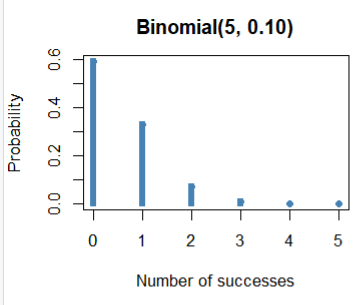
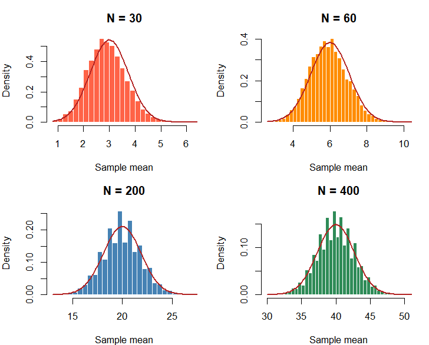
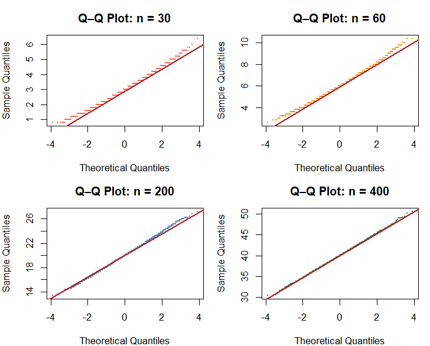
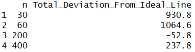
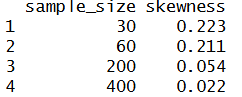
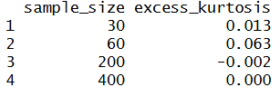
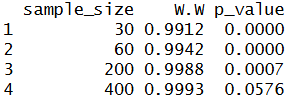

# Population: Binomial Small
<strong>Parameters/assumptions:</strong>
<p>n=5, p=0.10</p>

## 10.1 What population are you sampling from?
<p>
  The population that I am sampling from is the Binomial Small distribution.
  The two important characteristics of this population are its highly discrete distribution
  and its tendency to be heavily skewed. Its parameters are n = 5 and p = 0.10. 
</p>
```
n <- 5
p <- 0.10
k <- 0:n
prob <- dbinom(k, size = n, prob = p)

plot(k, prob, type = "h", lwd = 5, lend = 2,
     xlab = "Number of successes", ylab = "Probability",
     main = "Binomial(5, 0.10)", col = "steelblue")
points(k, prob, pch = 16, col = "steelblue")
```


## 10.2 What did you expect before running the simulation?
<p>
  Before running the Monte Carlo simulation for Binomial Small, I expected the sampling-means distribution
  to be right-skewed since the Binomial Small distribution is also right-skewed.
</p>
<p>
  For this analysis, my definition of "approximately normal" involves several requirements.
  First, for the histograms with the theoretical normal curves, the histogram must fit
  the theoretical normal curve by fitting under the curve, having no visible skewness at either tails,
  and having equal symmetry at the mean.
  Second, for the Q-Q plots, the simulated data must be close to the fitted line (i.e. the ideal line);
  this closeness will be determined by measuring from the fitted line to each sample mean
  the total deviation, which for the purposes of this analysis will be the closest absolute value to zero.
  Third, skewness will have to be the closest, absolute value to zero. If skewness is positive,
  there is a right tail. If skewness is negative, there is a left tail.
  Fourth, similar to skewness, excess-kurtosis will have to be the closest to zero. Positive kurtosis
  means heavier tails than normal (i.e. more extreme values). Negative kurtosis means lighter
  tails than normal (i.e.less extreme values).
  Finally, the Shapiro-Wilk test will need to yield a p-value of greater than 0.05 to show that
  the data does not deviate from normality (test result has to be used with Q-Q plots
  and histograms to prove data is normal). Otherwise, anything less than or equal to 0.05 shows
  that the data is non-normal.
</p>

## 10.3 What sample sizes did you investigate?
<p>
  For the Binomial Small distribution, I investigated the sample sizes of 30, 60, 200, and 400.
  These values were selectively chosen after conducting several trial-and-error Monte Carlo
  simulations to obtain a sample size that failed to reject the null hypothesis for the 
  Shapiro-Wilk test.
</p>

## 10.4 When did the sampling distribution become approximately normal?
<p>
  The sampling-means distribution for the Binomial Small distribution became approximately normal
  when n = 400.
</p>

## 10.5 Why did you choose that value?
<p>
  I chose n = 400, because there were several tests to support this value as the minimal sample size
  to approximate normal.
</p>
### Setup for tests
```
student_id <- 9438
set.seed(student_id)
B <- 10000
n <- 5
p <- 0.10
na <- 30
nb <- 60
nc <- 200
nd <- 400
means_a <- replicate(B, mean(rbinom(n, na, p)))
means_b <- replicate(B, mean(rbinom(n, nb, p)))
means_c <- replicate(B, mean(rbinom(n, nc, p)))
means_d <- replicate(B, mean(rbinom(n, nd, p)))

configs <- list(
  list(dat = means_a, N = na, col = "tomato"),
  list(dat = means_b, N = nb, col = "darkorange"),
  list(dat = means_c, N = nc, col = "steelblue"),
  list(dat = means_d, N = nd, col = "seagreen")
)
par(mfrow = c(2, 2), mar = c(4, 4, 3, 1))
```

### 10.5a Histograms
<p>
  The first test creates histograms of each sample size of n (30, 60, 200, and 400) and
  models them alongside a theoretical normal curve. Notably, the histograms for n = 30 and n = 60
  are both right-skewed, while the histograms for n = 200 and n = 400 appear more symmetrical.
</p>
```
for (cfg in configs) {
  hist(cfg$dat, breaks = 30, probability = TRUE,
       col = cfg$col, border = "white",
       main = paste("N =", cfg$N), xlab = "Sample mean"
  )
  curve(dnorm(x, mean = (cfg$N)*p, sd = sqrt(cfg$N*p*(1-p)/n)),
        add = TRUE, col = "firebrick", lwd = 2)
}
```


### 10.5b Q-Q plots and table
<p>
  The second test involves creating Q-Q plots and a table measuring the total deviation from the normal curve.
  The result of this test showed that the two sample sizes of 200 and 400 have the least absolute deviation from the normal curve.
</p>
```
qq_difference_table <- function(x) {
  x <- sort(na.omit(x))
  n <- length(x)
  
  theoretical <- qnorm(ppoints(n))
  
  q_theoretical <- qnorm(c(0.25, 0.75))
  q_sample <- quantile(x, c(0.25, 0.75))
  
  slope <- diff(q_sample) / diff(q_theoretical)
  intercept <- q_sample[1] - slope * q_theoretical[1]
  
  fitted <- intercept + slope * theoretical
  difference <- x - fitted
  
  data.frame(
    Theoretical_Quantile = theoretical,
    Observed_Quantile = x,
    Fitted_Line = fitted,
    Difference = difference,
    Absolute_Difference = abs(difference)
  )
}

for (cfg in configs) {
  qqnorm(cfg$dat, main = paste("Q–Q Plot: n =", cfg$n),
         col = cfg$col, pch = 16, cex = 0.3)
  qqline(cfg$dat, col = "firebrick", lwd = 2)
}

results <- do.call(rbind, lapply(configs, function(cfg) {
  qq_table <- qq_difference_table(cfg$dat)
  
  data.frame(
    n = cfg$n,
    Total_Deviation_From_Ideal_Line = sum(qq_table$Difference)
  )
}))
rownames(results) <- NULL
print(results)
```



### 10.5c Skewness
<p>
  The third test involves computing skewness for each sample size. A sample size of 400 yielded
  the least skewness which was 0.022.
</p>
```
skew <- function(x) {
  m3 <- mean((x - mean(x))^3)
  m2 <- mean((x - mean(x))^2)
  m3 / m2^(3/2)
}
data.frame(
  sample_size = c(na, nb, nc, nd),
  skewness = round(sapply(list(means_a, means_b, means_c, means_d), skew), 3)
)
```


### 10.5d Kurtosis
<p>
  The fourth test involves computing excess kurtosis for each sample size. A sample size of 400
  yielded the least excess kurtosis value of exactly 0.000.
</p>
```
kurt <- function(x) {
  m4 <- mean((x - mean(x))^4)
  m2 <- mean((x - mean(x))^2)
  m4 / m2^2 - 3
}
data.frame(
  sample_size = c(na, nb, nc, nd),
  excess_kurtosis = round(sapply(list(means_a, means_b, means_c, means_d), kurt), 3)
)
```


### 10.5e Shapiro-Wilk test
<p>
  The final test involves the Shapiro-Wilk test for each sample size. Only the sample size of 400
  failed to reject the null hypothesis with a p-value of 0.0576.
</p>
```
student_id <- 9438
set.seed(student_id)
sw <- function(x) {
  result <- shapiro.test(sample(x, 5000))
  c(W = round(result$statistic, 4), p_value = round(result$p.value, 4))
}
sw_results <- do.call(
  rbind,
  lapply(list(means_a, means_b, means_c, means_d), sw)
)
data.frame(sample_size = c(na, nb, nc, nd), sw_results, row.names = NULL)
```


## 10.6 What surprised you?
<p>
  First, I'm surprised by the appearance of the sampling-means distribution for Binomial Small distribution;
  the histograms for n = 200 and n = 400 look similar to the sampling-means distributions for Poisson distribution.
  Second, I'm also surprised by the minimal sample size to approximate normality, which was n = 400;
  this is easily the largest minimal n-value found, compared to other n-values yielded in analyzing
  other populations.
</p>
