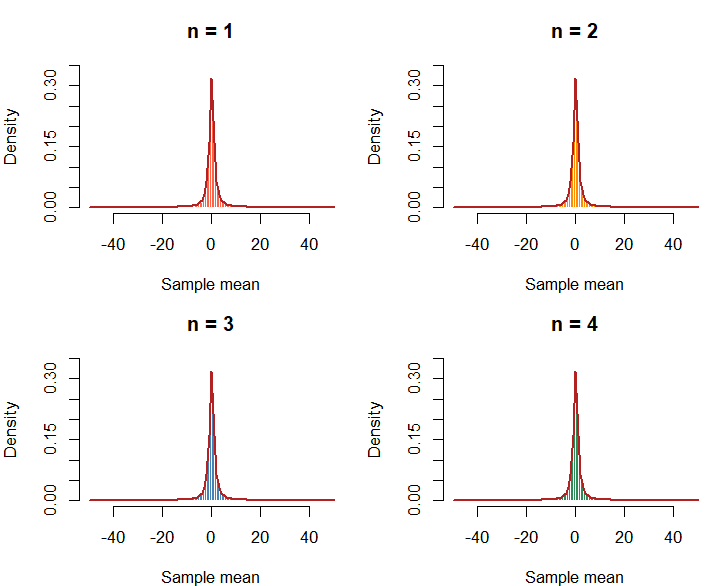
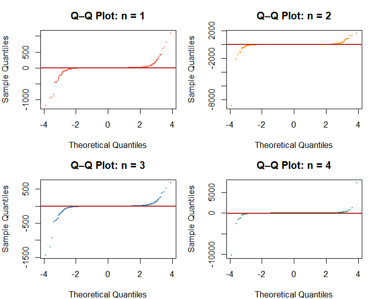
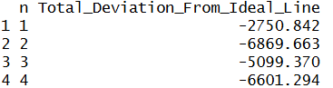
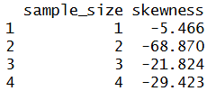
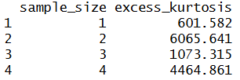
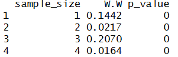

# Population: Cauchy
<strong>Parameters/assumptions:</strong>
<p>Location = 0, scale = 1</p>

## 10.1 What population are you sampling from?
<p>
  The population that I'm sampling from is the Cauchy distribution.
  One of the important characteristics of this population is that it does not have a
  population mean nor standard deviation. The main reason for this
  is that each observation (i.e. n) can dramatically move the mean.
  Another important characteristic of this population is that the tails are
  heavily weighted.
</p>


## 10.2 What did you expect before running the simulation?
<p> 
  Since the Cauchy distribution does not have a population mean nor standard deviation,
  I've expected that the sampling-means distribution to deviate the most from the normal curve
  compared to the other populations in other analyses.
  Given the volatility of the Cauchy distribution, I expect that a small sample size (less than 30)
  would be sufficient enough for the Cauchy distribution to approximate to normal.
</p>
<p>
  For this analysis, my definition of "approximately normal" involves several requirements.
  First, for the histograms with the theoretical normal curves, the histogram must fit
  the theoretical normal curve by fitting under the curve, having no visible skewness at either tails,
  and having equal symmetry at the mean.
  Second, for the Q-Q plots, the simulated data must be close to the fitted line (i.e. the ideal line);
  this closeness will be determined by measuring (from the fitted line to each sample mean)
  the total deviation, which for the purposes of this analysis will be the closest absolute value to zero.
  Third, skewness will have to be the closest, absolute value to zero. If skewness is positive,
  there is a right tail. If skewness is negative, there is a left tail.
  Fourth, similar to skewness, excess-kurtosis will have to be the closest to zero. Positive kurtosis
  means heavier tails than normal (i.e. more extreme values). Negative kurtosis means lighter
  tails than normal (i.e.less extreme values).
  Finally, the Shapiro-Wilk test will need to yield a p-value of greater than 0.05 to show that
  the data does not deviate from normality (test result has to be used with Q-Q plots
  and histograms to prove data is normal). Otherwise, anything less than or equal to 0.05 shows
  that the data is non-normal.
  If, for a given set of sample sizes, no sample size returns a meaningful p-value, the W.W-value (test statistic)
  will be used to determine a sample size that indicates normality. W.W. ranges from 0 to 1
  with W.W = 1 indicating perfect normality and W.W. = 0 indicating completely non-normal data.
  The sample size(s) with the closest W.W-values to zero are determined as sample sizes that indicate
  normality.
</p>

## 10.3 What sample sizes did you investigate?
<p>
  For the Monte Carlo simulation of the Cauchy distribution, I used the sample sizes of 1, 2, 3, and 4.
</p>

## 10.4 When did the sampling distribution become approximately normal?
<p>
  The sampling distribution for the Cauchy distribution became approximately normal
  when n = 1.
</p>

## 10.5 Why did you choose that value?
<p>
  I chose n = 1, because there were several tests to support this value as the minimal sample size
  to approximate normal.
</p>
### Setup for tests
```
student_id <- 9438
set.seed(student_id)
B <- 10000
loc <- 0
s <- 1
na <- 1
nb <- 2
nc <- 3
nd <- 4
means_a <- replicate(B, mean(rcauchy(na, loc, s)))
means_b <- replicate(B, mean(rcauchy(nb, loc, s)))
means_c <- replicate(B, mean(rcauchy(nc, loc, s)))
means_d <- replicate(B, mean(rcauchy(nd, loc, s)))

configs <- list(
  list(dat = means_a, n = na, col = "tomato"),
  list(dat = means_b, n = nb, col = "darkorange"),
  list(dat = means_c, n = nc, col = "steelblue"),
  list(dat = means_d, n = nd, col = "seagreen")
)
par(mfrow = c(2, 2), mar = c(4, 4, 3, 1))
```

### 10.5a Histograms
<p>
  The first test was to see how well each sampling means distribution fits under the theoretical
  normal curve. The result of this test showed that sample sizes of 1, 2, 3, and 4 all fit under the
  red normal curve. (Note: The size of each histogram plot was adjusted to make the histogram bars
  and theoretical normal curve visible.)
</p>
```
plot_min <- -50
plot_max <- 50
bin_width <- 1

for (cfg in configs) {
  # Keep only values in the displayed range
  visible_data <- cfg$dat[
    cfg$dat >= plot_min & cfg$dat <= plot_max
  ]
  
  hist(
    visible_data,
    breaks = seq(plot_min, plot_max, by = bin_width),
    probability = TRUE,
    col = cfg$col,
    border = "white",
    main = paste("n =", cfg$n),
    xlab = "Sample mean",
    xlim = c(plot_min, plot_max),
    ylim = c(0, 0.35)
  )
  
  curve(
    dcauchy(x, location = loc, scale = s),
    from = plot_min,
    to = plot_max,
    add = TRUE,
    col = "firebrick",
    lwd = 2
  )
}
```


### 10.5b Q-Q plots and table
<p>
  The second test was to create Q-Q plots for each sample size and create a table
  measuring total deviation for each sample size. Notably, n = 1 has the least total
  deviation from the normal curve with a value of -2750.842.
</p>
```
for (cfg in configs) {
  qqnorm(cfg$dat, main = paste("Q–Q Plot: n =", cfg$n),
         col = cfg$col, pch = 16, cex = 0.3)
  qqline(cfg$dat, col = "firebrick", lwd = 2)
}

results <- do.call(rbind, lapply(configs, function(cfg) {
  qq_table <- qq_difference_table(cfg$dat)
  
  data.frame(
    n = cfg$n,
    Total_Deviation_From_Ideal_Line = sum(qq_table$Difference)
  )
}))
rownames(results) <- NULL
print(results)
```



### 10.5c Skewness
<p>
  The third test was to compute skewness for each sample size. The sample size n = 1 
  had the least skewness of -5.466 (has a slight-left tail). Since n = 1 had the least skewness,
  it is the sample size that approximates closest to the normal distribution which has a
  skewness of 0.
</p>
```
skew <- function(x) {
  m3 <- mean((x - mean(x))^3)
  m2 <- mean((x - mean(x))^2)
  m3 / m2^(3/2)
}
data.frame(
  sample_size = c(na, nb, nc, nd),
  skewness = round(sapply(list(means_a, means_b, means_c, means_d), skew), 3)
)
```


### 10.5d Kurtosis
<p>
  The fourth test was to compute excess kurtosis for each sample size. The sample size n = 1
  had the least excess kurtosis of 601.582 (heavier tails than normal). Since n = 1 had the least
  excess kurtosis, it is the sample size that approximates closest to the normal distribution
  which has excess kurtosis of 0. 
</p>
```
kurt <- function(x) {
  m4 <- mean((x - mean(x))^4)
  m2 <- mean((x - mean(x))^2)
  m4 / m2^2 - 3
}
data.frame(
  sample_size = c(na, nb, nc, nd),
  excess_kurtosis = round(sapply(list(means_a, means_b, means_c, means_d), kurt), 3)
)
```


### 10.5e Shapiro-Wilk test
<p>
  The last test was the Shapiro-Wilk test which was applied to each sample size.
  Since, none of the sample sizes returned a p-value that failed to reject the null hypothesis,
  the test statistic (W.W.) has to be used as an alternative way to check for indications of normality.
  The sample sizes n = 1 (W.W. = 0.1442) and n = 3 (W.W. = 0.2070) have the two highest test statistics.
  Therefore, at n = 1 and n = 3, there are indications of normality in the sample-means distribution.
</p>
```
student_id <- 9438
set.seed(student_id)
sw <- function(x) {
  result <- shapiro.test(sample(x, 5000))
  c(W = round(result$statistic, 4), p_value = round(result$p.value, 4))
}
sw_results <- do.call(
  rbind,
  lapply(list(means_a, means_b, means_c, means_d), sw)
)
data.frame(sample_size = c(na, nb, nc, nd), sw_results, row.names = NULL)

```


## 10.6 What surprised you?
<p>
  What surprised me was that n = 1 was sufficiently large enough for the Cauchy distribution
  to approximate to the normal distribution. While I did expect the sample sizes to be less than 30,
  I did not expect that the minimum sample sizes were much less than my expected range.
</p>
