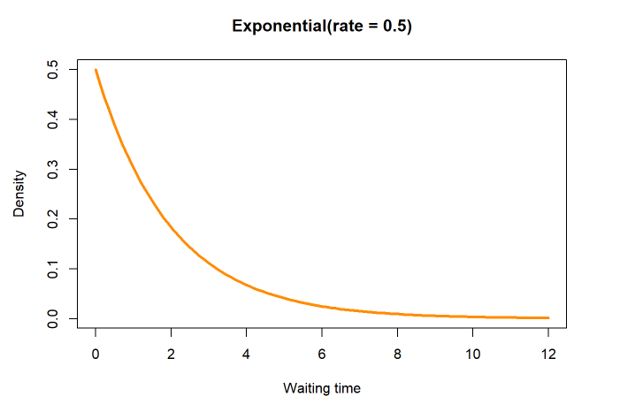
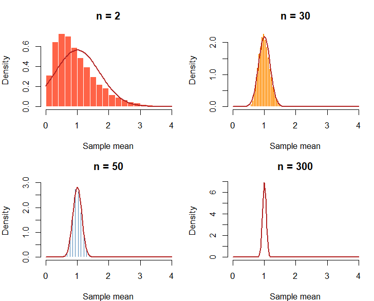
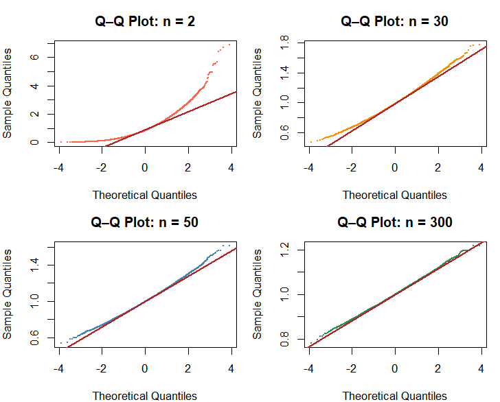
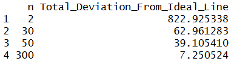
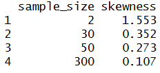
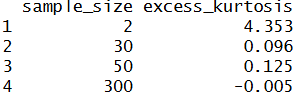
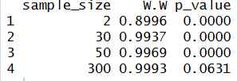

# Population: Exponential
<strong>Parameters/assumptions:</strong>
<p>λ = 1, mean = 1</p>

## 10.1 What population are you sampling from?
<p>
  The population that I am sampling from is the Exponential distribution.
  The most important characteristic of the Exponential distribution is its tendency
  to have a strong right skew. Its parameters are $\lambda$ = 1 and mean = 1.
</p>
```
curve(dexp(x, rate = 0.5), from = 0, to = 12,
      lwd = 3, col = "darkorange",
      xlab = "Waiting time", ylab = "Density",
      main = "Exponential(rate = 0.5)")
```


## 10.2 What did you expect before running the simulation?
<p>
  I expected that the sampling means distribution for the Exponential distribution
  will require more sample sizes than the Standard Normal distribution (i.e. > 30)
  to approximate to normal. This is because this distribution has the tendency
  to have a strong right skew, which means that the sampling means distribution will
  also be heavily influenced by a right skew. With fewer sample means, the distribution
  will appear right skewed. However, with larger sample sizes, the right skewness will dissipate
  and the sampling means distribution will appear more symmetric with even weights on both tails.
</p>
<p>
  For this analysis, my definition of "approximately normal" involves several requirements.
  First, for the histograms with the theoretical normal curves, the histogram must fit
  the theoretical normal curve by fitting under the curve, having no visible skewness at either tails,
  and having equal symmetry at the mean.
  Second, for the Q-Q plots, the simulated data must be close to the fitted line (i.e. the ideal line);
  this closeness will be determined by measuring from the fitted line to each sample mean
  the total deviation, which for the purposes of this analysis will be the closest absolute value to zero.
  Third, skewness will have to be the closest, absolute value to zero. If skewness is positive,
  there is a right tail. If skewness is negative, there is a left tail.
  Fourth, similar to skewness, excess-kurtosis will have to be the closest to zero. Positive kurtosis
  means heavier tails than normal (i.e. more extreme values). Negative kurtosis means lighter
  tails than normal (i.e.less extreme values).
  Finally, the Shapiro-Wilk test will need to yield a p-value of greater than 0.05 to show that
  the data does not deviate from normality (test result has to be used with Q-Q plots
  and histograms to prove data is normal). Otherwise, anything less than or equal to 0.05 shows
  that the data is non-normal.
</p>

## 10.3 What sample sizes did you investigate?
<p>
  I investigated the sampling means distribution for Exponential distribution with sample sizes
  of 2, 30, 50, and 300. I selected these values to be the sample-size set after a lengthy series
  of trial-and-error tests of finding an n value that satisfies the Shapiro-Wilk test.
</p>

## 10.4 When did the sampling distribution become approximately normal?
<p>
  The sampling distribution for the Exponential distribution
  became approximately normal when n = 300.
</p>

## 10.5 Why did you choose that value?
<p>
  I chose n = 300 to be the value for which the Uniform Discrete distribution becomes approximately normal
  because several tests support this. 
</p>
### Setup for tests
```
student_id <- 9438
set.seed(student_id)
B <- 10000
lambda <- 1
na <- 2
nb <- 30
nc <- 50
nd <- 300
means_a <- replicate(B, mean(rexp(na, rate=lambda)))
means_b <- replicate(B, mean(rexp(nb, rate=lambda)))
means_c <- replicate(B, mean(rexp(nc, rate=lambda)))
means_d <- replicate(B, mean(rexp(nd, rate=lambda)))

configs <- list(
  list(dat = means_a, n = na, col = "tomato"),
  list(dat = means_b, n = nb, col = "darkorange"),
  list(dat = means_c, n = nc, col = "steelblue"),
  list(dat = means_d, n = nd, col = "seagreen")
)
par(mfrow = c(2, 2), mar = c(4, 4, 3, 1))
```

### 10.5a Histogram test
<p>
  The first test was to see how well each sampling means distribution fits under the theoretical
  normal curve. The result of this test showed that sample sizes of 30, 50, and 300 all fit under the
  red normal curve.
</p>
```
for (cfg in configs) {
  hist(cfg$dat, breaks = 40, probability = TRUE,
       col = cfg$col, border = "white",
       main = paste("n =", cfg$n), xlab = "Sample mean", xlim = c(0,4)
  )
  curve(dnorm(x, mean = 1/lambda, sd = 1/(sqrt(cfg$n)*lambda)),
        add = TRUE, col = "firebrick", lwd = 2)
}
```

<br>
<br>

### 10.5b Q-Q plots and table
<p>
  The second test involves creating Q-Q plots and a table measuring the total deviation from the normal curve.
  The result of this test showed that the sample size of 300 yielded the least total deviation.
</p>
```
qq_difference_table <- function(x) {
  x <- sort(na.omit(x))
  n <- length(x)
  
  theoretical <- qnorm(ppoints(n))
  
  q_theoretical <- qnorm(c(0.25, 0.75))
  q_sample <- quantile(x, c(0.25, 0.75))
  
  slope <- diff(q_sample) / diff(q_theoretical)
  intercept <- q_sample[1] - slope * q_theoretical[1]
  
  fitted <- intercept + slope * theoretical
  difference <- x - fitted
  
  data.frame(
    Theoretical_Quantile = theoretical,
    Observed_Quantile = x,
    Fitted_Line = fitted,
    Difference = difference,
    Absolute_Difference = abs(difference)
  )
}

for (cfg in configs) {
  qqnorm(cfg$dat, main = paste("Q–Q Plot: n =", cfg$n),
         col = cfg$col, pch = 16, cex = 0.3)
  qqline(cfg$dat, col = "firebrick", lwd = 2)
}

results <- do.call(rbind, lapply(configs, function(cfg) {
  qq_table <- qq_difference_table(cfg$dat)
  
  data.frame(
    n = cfg$n,
    Total_Deviation_From_Ideal_Line = sum(qq_table$Difference)
  )
}))
rownames(results) <- NULL
print(results)
```


<br>
<br>

### 10.5c Skewness
<p>
  The third test involves computing skewness for each sample size. A sample size of 300 yielded
  the least skewness which was 0.107.
</p>
```
skew <- function(x) {
  m3 <- mean((x - mean(x))^3)
  m2 <- mean((x - mean(x))^2)
  m3 / m2^(3/2)
}
data.frame(
  sample_size = c(na, nb, nc, nd),
  skewness = round(sapply(list(means_a, means_b, means_c, means_d), skew), 3)
)
```

<br>
<br>

### 10.5d Kurtosis
<p>
  The fourth test involves computing excess kurtosis for each sample size. A sample size of 300
  yielded the least excess kurtosis value of -0.005.
</p>
```
kurt <- function(x) {
  m4 <- mean((x - mean(x))^4)
  m2 <- mean((x - mean(x))^2)
  m4 / m2^2 - 3
}
data.frame(
  sample_size = c(na, nb, nc, nd),
  excess_kurtosis = round(sapply(list(means_a, means_b, means_c, means_d), kurt), 3)
)
```

<br>
<br>

### 10.5e Shapiro-Wilk test
<p>
  The final test involves the Shapiro-Wilk test for each sample size. Only the sample size of 300
  failed to reject the null hypothesis with a p-value of 0.0631.
</p>
```
student_id <- 9438
set.seed(student_id)
sw <- function(x) {
  result <- shapiro.test(sample(x, 5000))
  c(W = round(result$statistic, 4), p_value = round(result$p.value, 4))
}
sw_results <- do.call(
  rbind,
  lapply(list(means_a, means_b, means_c, means_d), sw)
)
data.frame(sample_size = c(na, nb, nc, nd), sw_results, row.names = NULL)
```


## 10.6 What surprised you?
<p>
  I'm surprised that the sampling means distribution for the Exponential distribution
  required a higher-than-expected sample size to yield a meaningful p-value.
</p>
