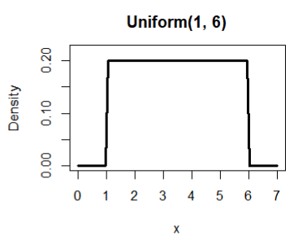
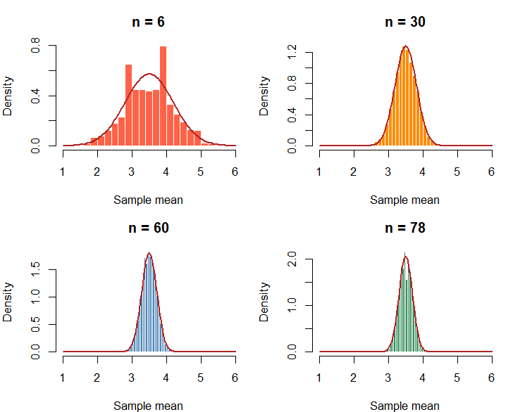
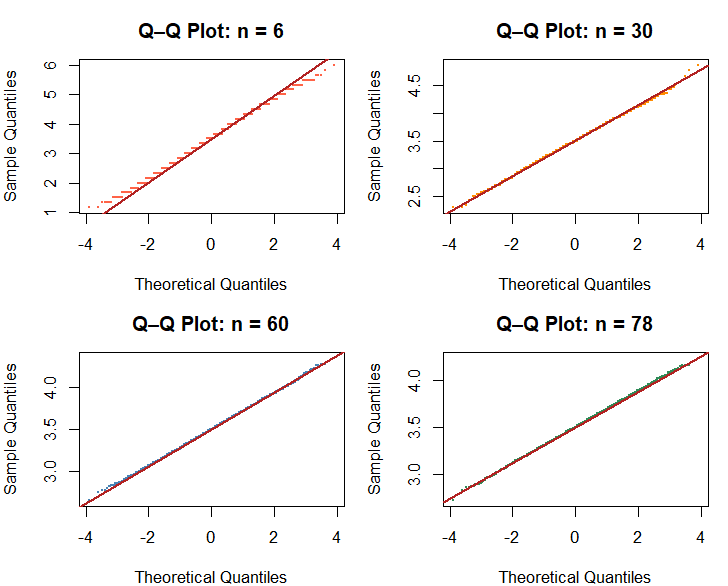
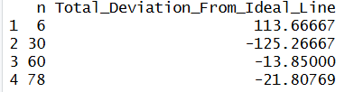
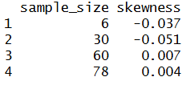
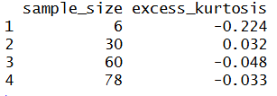
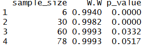

# Population: Six-Sided Die
<strong>Parameters/assumptions:</strong>
<p>Values 1-6, equally likely</p>

## 10.1 What population are you sampling from?
<p>
  The population that I'm sampling from is a six-sided die.
  The most important characteristic of a six-sided die is that it is a Uniform Discrete distribution
  with parameters a = 1 and b = 6. Also, it is assumed that each outcome (i.e. the result on each face of the die)
  is equally likely.
</p>

```
curve(dunif(x, min = 1, max = 6), from = 0, to = 10,
      ylim = c(0, 0.22), lwd = 3,
      xlab = "x", ylab = "Density",
      main = "Uniform(2, 8)")
```


## 10.2 What did you expect before running the simulation?
<p>
  I expected the sample means distribution to center itself around the mean of 3.5, since
  the average roll of a six-sided die would be 3.5 ([1 + 2 + 3 + 4 + 5 + 6] / 6 = 3.5).
  I also expect that the minimal sample size to make the Uniform Discrete sampling means distribution
  normal would be n = 12. 
</p>
<p>
  For this analysis, my definition of "approximately normal" involves several requirements.
  First, for the histograms with the theoretical normal curves, the histogram must fit
  the theoretical normal curve by fitting under the curve, having no visible skewness at either tails,
  and having equal symmetry at the mean.
  Second, for the Q-Q plots, the simulated data must be close to the fitted line (i.e. the ideal line);
  this closeness will be determined by measuring from the fitted line to each sample mean
  the total deviation, which for the purposes of this analysis will have to be less than 1.0.
  Third, skewness will have to be the closest, absolute value to zero. If skewness is positive,
  there is a right tail. If skewness is negative, there is a left tail.
  Fourth, similar to skewness, excess-kurtosis will have to be the closest to zero. Positive kurtosis
  means heavier tails than normal (i.e. more extreme values). Negative kurtosis means lighter
  tails than normal (i.e.less extreme values).
  Finally, the Shapiro-Wilk test will need to yield a p-value of greater than 0.05 to show that
  the data does not deviate from normality (test result has to be used with Q-Q plots
  and histograms to prove data is normal). Otherwise, anything less than or equal to 0.05 shows
  that the data is non-normal.
</p>

## 10.3 What sample sizes did you investigate?
<p>
  I started running the Monte Carlo Simulations for the Uniform Discrete distribution
  with sample sizes of 6, 12, 18, and 24. I used these sample sizes as a starter.
  Every test turned out to be acceptable, except for the Shapiro-Wilk test; almost all
  p-values for each sample size returned were less than 0.05, which meant that the data was non-normal.
</p>
<p>
  I then tried to experiment with different sets of sample sizes to find one that would fulfill the
  Shapiro-Wilk test. Finally, I settled with sample sizes of 6, 30, 60, and 78 (i.e. n = 6,
   n = 30, n = 60, and n = 78) as my final set to use for my analysis.
</p>

## 10.4 When did the sampling distribution become approximately normal?
<p>
  The sampling distribution for the six-sided die (i.e. Uniform Discrete) 
  became approximately normal at n = 78.
</p>

## 10.5 Why did you choose that value?
<p>
  I chose n = 78 to be the value for which the Uniform Discrete distribution becomes approximately normal
  because several tests support this. 
</p>
### Setup for tests
```
student_id <- 9438
set.seed(student_id)
B <- 10000
na <- 6
nb <- 30
nc <- 60
nd <- 78
means_a <- replicate(B, mean(sample(1:6, size=na, replace=TRUE)))
means_b <- replicate(B, mean(sample(1:6, size=nb, replace=TRUE)))
means_c <- replicate(B, mean(sample(1:6, size=nc, replace=TRUE)))
means_d <- replicate(B, mean(sample(1:6, size=nd, replace=TRUE)))

configs <- list(
  list(dat = means_a, n = na, col = "tomato"),
  list(dat = means_b, n = nb, col = "darkorange"),
  list(dat = means_c, n = nc, col = "steelblue"),
  list(dat = means_d, n = nd, col = "seagreen")
)
par(mfrow = c(2, 2), mar = c(4, 4, 3, 1))
```

### 10.5a Histograms test
<p>
  The first test was to see how well each sampling means distribution fits under the theoretical
  normal curve. The result of this test showed that sample sizes of 30, 60, and 78 all fit under the
  red normal curve.
</p>
```
for (cfg in configs) {
  hist(cfg$dat, breaks = 30, probability = TRUE,
       col = cfg$col, border = "white",
       main = paste("n =", cfg$n), xlab = "Sample mean",
       xlim = c(1, 6))
  curve(dnorm(x, mean = (6+1)/2, sd = sqrt(
    ((6-1+1)^2 - 1) / (12 * cfg$n)
  )), add = TRUE, col = "firebrick", lwd = 2)
}
```

<br>
<br>

### 10.5b Q-Q plots and table
<p>
  The second test involves creating Q-Q plots and a table measuring the total deviation from the normal curve.
  The result of this test showed that sample sizes of 60 and 78 yielded the least total deviations.
</p>
```
qq_difference_table <- function(x) {
  x <- sort(na.omit(x))
  n <- length(x)
  
  theoretical <- qnorm(ppoints(n))
  
  q_theoretical <- qnorm(c(0.25, 0.75))
  q_sample <- quantile(x, c(0.25, 0.75))
  
  slope <- diff(q_sample) / diff(q_theoretical)
  intercept <- q_sample[1] - slope * q_theoretical[1]
  
  fitted <- intercept + slope * theoretical
  difference <- x - fitted
  
  data.frame(
    Theoretical_Quantile = theoretical,
    Observed_Quantile = x,
    Fitted_Line = fitted,
    Difference = difference,
    Absolute_Difference = abs(difference)
  )
}

for (cfg in configs) {
  qqnorm(cfg$dat, main = paste("Q–Q Plot: n =", cfg$n),
         col = cfg$col, pch = 16, cex = 0.3)
  qqline(cfg$dat, col = "firebrick", lwd = 2)
}

results <- do.call(rbind, lapply(configs, function(cfg) {
  qq_table <- qq_difference_table(cfg$dat)
  
  data.frame(
    n = cfg$n,
    Total_Deviation_From_Ideal_Line = sum(qq_table$Difference)
  )
}))
rownames(results) <- NULL
print(results)
```


<br>
<br>

### 10.5c Skewness
<p>
  The third test involves computing skewness for each sample size. A sample size of 78 yielded
  the least skewness which was 0.004.
</p>
```
skew <- function(x) {
  m3 <- mean((x - mean(x))^3)
  m2 <- mean((x - mean(x))^2)
  m3 / m2^(3/2)
}
data.frame(
  sample_size = c(na, nb, nc, nd),
  skewness = round(sapply(list(means_a, means_b, means_c, means_d), skew), 3)
)
```

<br>
<br>

### 10.5d Kurtosis
<p>
  The fourth test involves computing excess kurtosis for each sample size. A sample size of 30 and 78
  yielded the least excess kurtosis values.
</p>
```
kurt <- function(x) {
  m4 <- mean((x - mean(x))^4)
  m2 <- mean((x - mean(x))^2)
  m4 / m2^2 - 3
}
data.frame(
  sample_size = c(na, nb, nc, nd),
  excess_kurtosis = round(sapply(list(means_a, means_b, means_c, means_d), kurt), 3)
)
```

<br>
<br>

### 10.5e Shapiro-Wilk test
<p>
  The final test involves the Shapiro-Wilk test for each sample size. Only the sample size of 78
  failed to reject the null hypothesis with a p-value of 0.0517.
</p>
```
student_id <- 9438
set.seed(student_id)
sw <- function(x) {
  result <- shapiro.test(sample(x, 5000))
  c(W = round(result$statistic, 4), p_value = round(result$p.value, 4))
}
sw_results <- do.call(
  rbind,
  lapply(list(means_a, means_b, means_c, means_d), sw)
)
data.frame(sample_size = c(na, nb, nc, nd), sw_results, row.names = NULL)
```


## 10.6 What surprised you?
<p>
  I was surprised that I underestimated the minimal sample size for the distribution to approximate
  to normal. My original prediction was that n = 30 was sufficiently large, but the results from 
  the Monte Carlo simulations show that n = 78 is sufficiently large.
</p>
