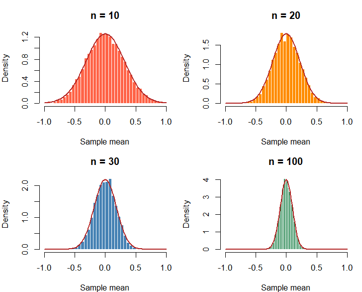
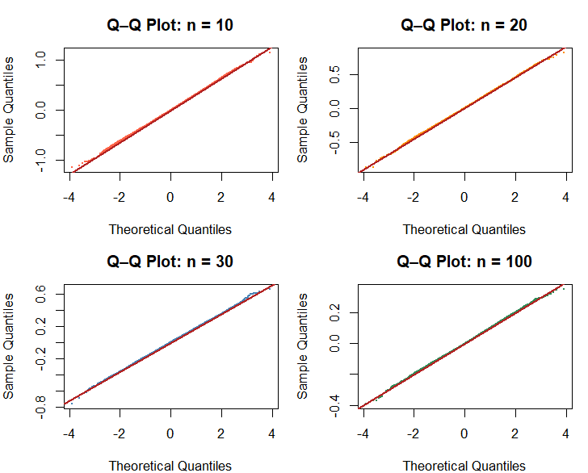
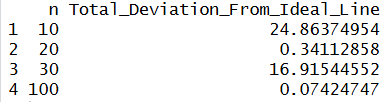
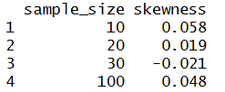
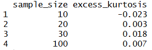
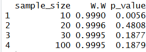

# Population: Standard Normal
<strong>Parameters/assumptions:</strong>
<p>μ=0, σ=1</p>

## 10.1 What population are you sampling from?
<p>
  The population that I'm sampling from is the Standard Normal Distribution.
  The most important characteristic of this particular distribution is
  that its population is considered as normal (i.e. $\mu$ = 0 and $\sigma$ = 1).
  Another key characteristic of this distribution is its precise distribution of data;
  68% of data falls within 1 standard deviation of the mean,
  95% of data falls within 2 standard deviations of the mean,
  and 99.7% of data falls within 3 standard deviations of the mean.
</p>


## 10.2 What did you expect before running the simulation?
<p>
  Before running the Monte Carlo Simulation with the Standard Normal Distribution, I predicted that 
  the sampling means distribution for the Standard Normal Distribution
  would appear normal when the sample size is 30 (i.e. n = 30). This prediction is based off of my
  prior knowledge of the Central Limit Theorem which states that n = 30 is sufficiently large enough
  to make the sampling distribution to become approximately normal.
</p>
<p>
  For this analysis, my definition of "approximately normal" involves several requirements.
  First, for the histograms with the theoretical normal curves, the histogram must fit
  the theoretical normal curve by fitting under the curve, having no visible skewness at either tails,
  and having equal symmetry at the mean.
  Second, for the Q-Q plots, the simulated data must be close to the fitted line (i.e. the ideal line);
  this closeness will be determined by measuring from the fitted line to each sample mean
  the total deviation, which for the purposes of this analysis will have to be less than 1.0.
  Third, skewness will have to be the closest, absolute value to zero. If skewness is positive,
  there is a right tail. If skewness is negative, there is a left tail.
  Fourth, similar to skewness, excess-kurtosis will have to be the closest to zero. Positive kurtosis
  means heavier tails than normal (i.e. more extreme values). Negative kurtosis means lighter
  tails than normal (i.e.less extreme values).
  Finally, the Shapiro-Wilk test will need to yield a p-value of greater than 0.05 to show that
  the data does not deviate from normality (test result has to be used with Q-Q plots
  and histograms to prove data is normal). Otherwise, anything less than or equal to 0.05 shows
  that the data is non-normal.
</p>

## 10.3 Which sample sizes did you investigate?
<p>
  I started running the Monte Carlo Simulations for the Standard Normal Distribution
  with sample sizes 10, 20, 30, and 100 (i.e. n = 10, n = 20, n = 30, n = 100).
  I chose these values for two reasons.
  First, the Central Limit Theorem (CLT) states that as n becomes larger, the sample means distribution
  becomes more normal. Second, since the Standard Normal Distribution uses a normal population, 
  I expected the sampling means distribution to appear normal at n = 30, the minimum sample size
  in order to be considered "sufficiently large enough" to work with.
</p>

## 10.4 When did the sampling distribution become approximately normal?
<p>
  The sampling distribution for Standard Normal became approximately normal when n = 20.
</p>

## 10.5 Why did you choose that value?
<p>
  I chose n = 20 as the sample size for the Standard Normal sampling distribution to approximate
  to normal, because there were several tests that support this value.
</p>
### Setup for tests
```
student_id <- 9438
set.seed(student_id)
B <- 10000
na <- 10
nb <- 20
nc <- 30
nd <- 100
means_a <- replicate(B, mean(rnorm(na)))
means_b <- replicate(B, mean(rnorm(nb)))
means_c <- replicate(B, mean(rnorm(nc)))
means_d <- replicate(B, mean(rnorm(nd)))

configs <- list(
  list(dat = means_a, n = na, col = "tomato"),
  list(dat = means_b, n = nb, col = "darkorange"),
  list(dat = means_c, n = nc, col = "steelblue"),
  list(dat = means_d, n = nd, col = "seagreen")
)
par(mfrow = c(2, 2), mar = c(4, 4, 3, 1))
```
### 10.5a Histogram test
<p>
  First, I created histograms of the sampling means distributions for each n.
  Unsurprisingly, each histogram appears normal, since each of them were symmetric and no obvious
  signs of skewness. This test did not narrow much about the "value" of n.
</p>

```
for (cfg in configs) {
  hist(cfg$dat, breaks = 40, probability = TRUE,
       col = cfg$col, border = "white",
       main = paste("n =", cfg$n), xlab = "Sample mean",
       xlim = c(-1, 1))
  curve(dnorm(x, mean = 0, sd = 1/sqrt(cfg$n)),
        add = TRUE, col = "firebrick", lwd = 2)
}
```

<br>
<br>

### 10.5b Q-Q plots and table
<p>
  However, the next test, Q-Q plots, had more to say. Similar to the histograms, I generated
  four Q-Q plots, where each graph captures the sampling-means' data and the red regression line
  (the latter of which represents a normal distribution), and also a table, which outputs the
  total deviation of sample means from the red regression line. Notably, n = 20 had a total deviation
  of approximately 0.34, which is less than 1.0.
</p>

```
qq_difference_table <- function(x) {
  x <- sort(na.omit(x))
  n <- length(x)
  
  theoretical <- qnorm(ppoints(n))
  
  q_theoretical <- qnorm(c(0.25, 0.75))
  q_sample <- quantile(x, c(0.25, 0.75))
  
  slope <- diff(q_sample) / diff(q_theoretical)
  intercept <- q_sample[1] - slope * q_theoretical[1]
  
  fitted <- intercept + slope * theoretical
  difference <- x - fitted
  
  data.frame(
    Theoretical_Quantile = theoretical,
    Observed_Quantile = x,
    Fitted_Line = fitted,
    Difference = difference,
    Absolute_Difference = abs(difference)
  )
}

for (cfg in configs) {
  qqnorm(cfg$dat, main = paste("Q–Q Plot: n =", cfg$n),
         col = cfg$col, pch = 16, cex = 0.3)
  qqline(cfg$dat, col = "firebrick", lwd = 2)
}

results <- do.call(rbind, lapply(configs, function(cfg) {
  qq_table <- qq_difference_table(cfg$dat)
  
  data.frame(
    n = cfg$n,
    Total_Deviation_From_Ideal_Line = sum(qq_table$Difference)
  )
}))
rownames(results) <- NULL
print(results)
```


<br>
<br>

### 10.5c Skewness
<p>
  The following test on skewness also provides evidence as well. Out of all of the sample sizes,
  the sample size of 20 has the least skewness.
</p>

```
skew <- function(x) {
  m3 <- mean((x - mean(x))^3)
  m2 <- mean((x - mean(x))^2)
  m3 / m2^(3/2)
}
data.frame(
  sample_size = c(na, nb, nc, nd),
  skewness = round(sapply(list(means_a, means_b, means_c, means_d), skew), 3)
)
```

<br>
<br>

### 10.5d Kurtosis
<p>
  Similarly, the next test on kurtosis also shows that the sample size of 20 had the least excess kurtosis.
</p>
```
kurt <- function(x) {
  m4 <- mean((x - mean(x))^4)
  m2 <- mean((x - mean(x))^2)
  m4 / m2^2 - 3
}
data.frame(
  sample_size = c(na, nb, nc, nd),
  excess_kurtosis = round(sapply(list(means_a, means_b, means_c, means_d), kurt), 3)
)
```

<br>
<br>

### 10.5e Shapiro-Wilk test
<p>
  The final test that I ran to confirm my choice was the Shapiro-Wilk test.
  This test returns a designated p-value to each sample size which corresponds one of the two hypotheses.
  The null hypothesis H<sub>O</sub> is that the data is normally distributed.
  The alternative hypothesis H<sub>A</sub> is that the data is not normally distributed.
  When p > 0.05, we fail to reject the null-hypothesis and thus say the data does not deviate
  from normal.
  Otherwise, when p <= 0.05, we reject the null-hypothesis and thus say the data is non-normal.
  At a sample size of 20, p = 0.4806 which is greater than 0.05. Therefore, at n = 20,
  we fail to reject the null hypothesis.
</p>

```
student_id <- 9438
set.seed(student_id)
sw <- function(x) {
  result <- shapiro.test(sample(x, 5000))
  c(W = round(result$statistic, 4), p_value = round(result$p.value, 4))
}
sw_results <- do.call(
  rbind,
  lapply(list(means_a, means_b, means_c, means_d), sw)
)
data.frame(sample_size = c(na, nb, nc, nd), sw_results, row.names = NULL)
```


## 10.6 What surprised you?
<p>
  I was surprised by much I overestimated the minimal sample size for the distribution to approximate to normal.
  Instead of approximating to normal at n = 30, the sample means distribution approximated to normal at n = 20.
</p>